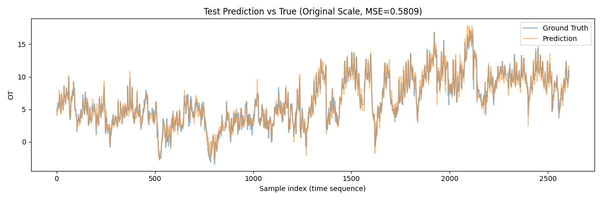
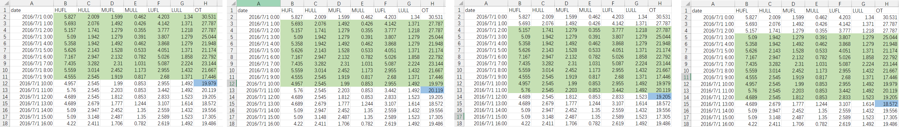

# RNN Oil Temperature Prediction Project

A multivariate time series prediction project based on Recurrent Neural Networks (RNN), using data from the previous 10 time steps to predict the target oil temperature (OT) at the next time step.

## Project Overview

This project implements a PyTorch-based RNN time series prediction model for predicting the target oil temperature (OT) in the ETTh1 dataset. The model uses 7-dimensional features (HUFL, HULL, MUFL, MULL, LUFL, LULL, OT) from the past 10 time steps (10 rows of data) to predict the oil temperature value at the next time step.

## Dataset

The project uses the **ETTh1** dataset, which is a power transformer oil temperature dataset containing the following 7 features:

| Feature | Description |
|---------|-------------|
| HUFL | High Voltage Frequency Load |
| HULL | High Voltage Low Frequency Load |
| MUFL | Medium Voltage Frequency Load |
| MULL | Medium Voltage Low Frequency Load |
| LUFL | Low Voltage Frequency Load |
| LULL | Low Voltage Low Frequency Load |
| **OT** | **Oil Temperature (Target)** |

The dataset is located at `ETT-small/ETTh1.csv`.
Dataset source: [ETTh1 Dataset](https://github.com/zhouhaoyi/ETDataset)

## Project Structure

```
RNN_OTP/
├── ETT-small/              # Dataset directory
│   └── ETTh1.csv           # ETTh1 oil temperature dataset
├── img/                    # Image directory
│   ├── 1.png               # Window slicing diagram
│   └── 2.png               # Test result plot
├── data_loader.py          # Data loader implementing ETTDataset class
├── model.py                # RNN model definition
├── train.py                # Main training and testing script
├── last_epoch.pth          # Trained model weights
└── README.md               # Project documentation
```

## File Description

| File | Description |
|------|-------------|
| `data_loader.py` | Implements the `ETTDataset` class, responsible for reading data from CSV files, slicing time windows, standardization, and converting time series data to supervised learning samples |
| `model.py` | Defines the `RNNModel` class, implementing a multi-layer RNN network structure that accepts 7-dimensional feature input and outputs a single-step oil temperature prediction |
| `train.py` | Main training and testing script containing `run_train()` and `run_test()` functions, coordinating data loading, model training, evaluation, and result visualization |
| `last_epoch.pth` | Saved model weights after training completion, can be directly loaded for inference |

## Installation

Ensure Python 3.8+ is installed, then install the required dependencies:

```bash
pip install torch pandas numpy scikit-learn matplotlib
```

## Quick Start

### Train the Model

1. Open `train.py` and uncomment the run_train function line:
```python
run_train(model=model, train_loader=train_loader, num_epochs=200)
```

2. Run the training script:
```bash
python train.py
```

During training, the average loss per epoch will be printed. After training completes, the model weights will be saved to `last_epoch.pth`.

### Test the Model

1. Ensure the trained model `last_epoch.pth` exists
2. Open `train.py`, comment the training code, and uncomment the run_test function line:
```python
run_test(model=model, test_loader=test_loader, scaler_y=train_dataset.scaler_y, plot=True)
```

3. Run the test script:
```bash
python train.py
```

After testing completes, the MSE error in the original scale will be output, and a comparison plot of predicted vs. actual curves will be displayed.



## Model Architecture

### RNNModel

The RNN model structure used in this project is as follows:

```
Input Layer → RNN Layer (Multi-layer) → Fully Connected Layer → Output
```

**Model Parameters:**
- `input_size`: 7 (7-dimensional feature input)
- `hidden_size`: 256 (Hidden layer dimension)
- `num_layers`: 2 (Number of stacked RNN layers)
- `output_size`: 1 (Single oil temperature prediction)

**Forward Propagation Process:**
1. Input tensor shape: `(batch_size, seq_len=10, input_size=7)`
2. Get the hidden state of the last time step through the RNN layer
3. Map to output dimension through the fully connected layer to get the prediction

## Data Processing Flow

```
Raw Data CSV → ETTDataset (Window Slicing) → StandardScaler Normalization → DataLoader → RNN Model
                                                                           ↓
                                                          Denormalization → Original Scale Prediction → Plot Evaluation
```

**Key Processing Steps:**
1. **Window Slicing**: Extract samples from time series using sliding window with history window size of 10 to predict the oil temperature at the next time step.
   The sliding window moves 1 time step downward each time in the diagram. The actual step_size in the code is 2.
   
2. **Normalization**: Use `StandardScaler` to normalize features and labels separately. Fit on training set only, reuse scaler for test set.
   The correct workflow must be:
   1. Split training/test sets first;
   2. Fit scaler on training set only;
   3. Transform both training and test sets using this scaler.
   If fitting scaler on all data, the test set mean/variance will contain future trends, essentially "leaking" the overall numerical range of the test set to the model.
3. **Denormalization**: Restore results to original scale for evaluation after prediction

## Training Configuration

| Parameter | Value | Description |
|-----------|-------|-------------|
| Training Set Ratio | 70% | Data split chronologically |
| Batch Size | 64 | Mini-batch training |
| Learning Rate | 0.001 | Adam optimizer |
| Loss Function | MSE | Mean Squared Error |
| Training Epochs | 200 | Default value |
| History Window | 10 | Use data from past 10 time steps |

## Evaluation Metrics

The model is evaluated using **Mean Squared Error (MSE) in the original scale** on the test set:

```python
mse_original = np.mean((pred_original - true_original) ** 2)
```

## Usage Examples

### Data Loading Example

```python
from data_loader import ETTDataset
from torch.utils.data import DataLoader

# Create training set (with normalization enabled)
train_dataset = ETTDataset(
    df=train_df[['HUFL', 'HULL', 'MUFL', 'MULL', 'LUFL', 'LULL', 'OT']],
    history_size=10,
    future_size=1,
    step_size=2,
    SCALER=True
)

# Create test set (reuse training set scaler)
test_dataset = ETTDataset(
    df=test_df[['HUFL', 'HULL', 'MUFL', 'MULL', 'LUFL', 'LULL', 'OT']],
    history_size=10,
    future_size=1,
    step_size=2,
    SCALER=False
)
test_dataset.set_scaler(*train_dataset.get_scaler())

# Create DataLoader
train_loader = DataLoader(train_dataset, batch_size=64, shuffle=True)
test_loader = DataLoader(test_dataset, batch_size=64, shuffle=False)
```

### Model Definition Example

```python
from model import RNNModel

# Create model
model = RNNModel(input_size=7, hidden_size=256, num_layers=2, output_size=1)

# Load trained model
model = torch.load("./last_epoch.pth")
```

## Notes

1. **Data Order**: Feature columns must be passed in the order `[HUFL, HULL, MUFL, MULL, LUFL, LULL, OT]`
2. **Normalization Consistency**: The test set must use the scaler fitted on the training set, otherwise prediction results will be biased
3. **Test Set Order**: Set `shuffle=False` during testing to maintain time series order
4. **GPU Acceleration**: If CUDA is supported, the model will automatically use GPU for training and inference

## Technology Stack

- **Framework**: PyTorch 1.x
- **Data Processing**: Pandas, NumPy
- **Normalization**: scikit-learn StandardScaler
- **Visualization**: Matplotlib

## License

This project is for learning and research purposes only.

---

*Well-structured project with detailed code comments. Welcome to reference and use!*